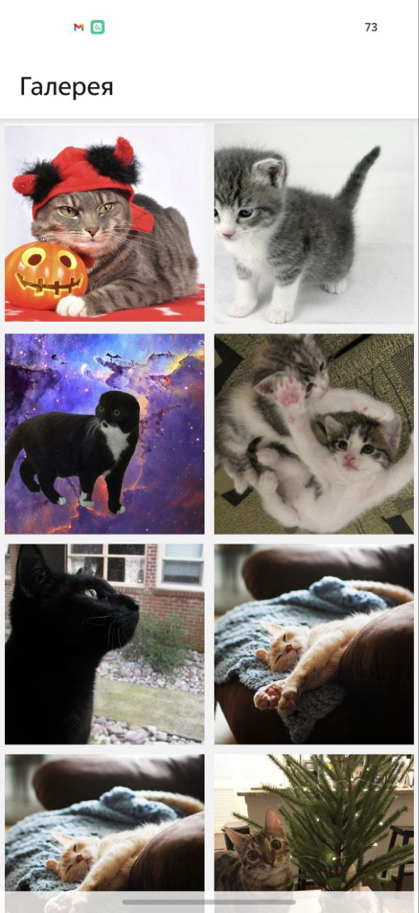

# Котогалерея

Мобильное приложение на React Native с использованием TypeScript, MobX и Axios для просмотра галереи фотографий котов. Каждая фотография появляется с анимацией прокрутки. Щелчок по фотографии позволяет просмотреть её в режиме полного экрана с возможностью изменения масштаба.

## Скриншоты


_Главный экран (домашняя страница)_


_Просмотр отдельной фотографии_


_Пример зума фотографии_

## Возможности

- Список фотографий в виде сетки
- Просмотр фото на весь экран с зумом и свайпом вниз для возврата
- Анимация появления карточек
- MobX для управления состоянием
- Поддержка pull-to-refresh и пагинации

## Установка и запуск

1. **Установите зависимости:**

   ```sh
   npm install
   ```

2. **Создайте файл .env и укажите ключ API для thecatapi.com:**

   ```env
   CAT_API_KEY=ваш_ключ
   ```

   Ключ можно также добавить в переменные окружения на уровне ОС или при запуске приложения через cmd/bash.

3. **Android:**

   - Убедитесь, что установлен JDK 17 (или 11), Android Studio и эмулятор/устройство.
   - Запустите Metro bundler:
     ```sh
     npx react-native start --reset-cache
     ```
   - В другом терминале:
     ```sh
     npm run android
     ```

4. **iOS:**
   - Убедитесь, что установлен Xcode и CocoaPods.
   - Установите pods:
     ```sh
     cd ios && pod install && cd ..
     ```
   - Запустите Metro bundler:
     ```sh
     npx react-native start --reset-cache
     ```
   - В другом терминале:
     ```sh
     npm run ios
     ```

## Структура проекта

```
├── src/
│   ├── api/                # Работа с внешними API (axios)
│   ├── components/         # Переиспользуемые UI-компоненты
│   ├── navigation/         # Централизованная логика и типы навигации
│   ├── screens/            # Экраны приложения (HomeScreen, PhotoScreen)
│   ├── stores/             # MobX-сторы для состояния (PhotoStore)
│   ├── types/              # Общие типы
```

- Все зависимости навигации и роутинга изолированы в каталоге `src/navigation`.
- Экраны и их опции определяются централизованно в `screens` и прокидываются в навигатор.
- Для управления состоянием используется MobX (`stores/PhotoStore.ts`).
- Типы вынесены в `types/index.ts` для строгой типизации.

## Примечания

- Для работы pinch-to-zoom используется `react-native-image-zoom-viewer` (без reanimated).

---
